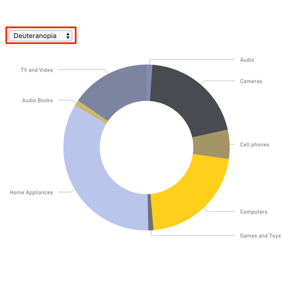

# Color Helper for Power BI

Color Helper by OKViz is useful to temporarily replace any existing chart on your reports, just to figure out how color blind people will see the colors that the chart itself uses. 

Find out more on https://okviz.com/color-helper/

### Copyrights

Copyright (c) 2016-2018 OKViz - trademark of SQLBI Corp.

See the [LICENSE](/LICENSE) file for license rights and limitations (MIT).
